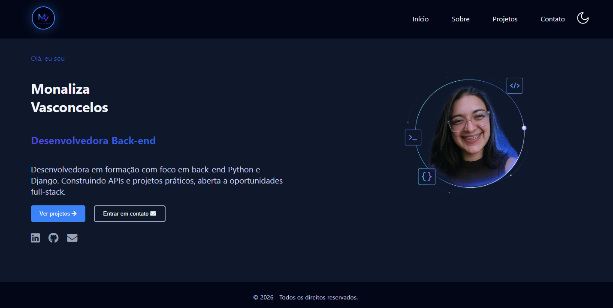

# 👩‍💻 Portfólio - Monaliza Vasconcelos

Bem-vindo ao meu portfólio!
Este projeto foi desenvolvido com foco em apresentar minhas habilidades como desenvolvedora Full Stack, meus projetos, experiências e tecnologias que venho estudando.

---
## 🚀 Tecnologias utilizadas
React
Vite
React Router DOM
CSS3
JavaScript
HTML5

---
## ✨ Funcionalidades
Navegação entre páginas
Layout responsivo
Página inicial moderna
Sessão sobre mim
Projetos desenvolvidos
Contato

---
## 📸 Preview


---
## 📂 Estrutura do projeto
```bash
src/
├── assets/
├── components/
├── pages/
├── App.jsx
├── main.jsx
└── App.css
```

---
## ⚙️ Como executar o projeto
Clone o repositório:
```bash
git clone https://github.com/Monaliza-Vasconcelos/monaliza-vasconcelos-portfolio.git
```
Acesse a pasta:
```bash
cd monaliza-vasconcelos-portifolio
cd portifolio
```
Instale as dependências:
```bash
npm install
```
Execute o projeto:
```bash
npm run dev
```

---
## 🌐 Deploy

Projeto hospedado na Vercel.

[Acessar Portfólio](https://monaliza-vasconcelos-portfolio-dw1w.vercel.app/)


